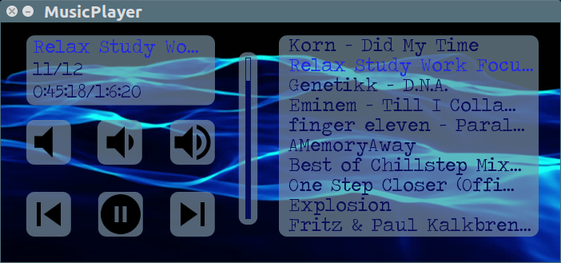

# musicplayer372
*Readme*

GUI Music Player

Created by:

Bryan Burkhardt (bmburkhardt@alaska.edu)  
Alexander Eckert (aeckert@alaska.edu)  
Jeremiah Jacobson (jjjacobson2@alaska.edu)  
Jarye Murphy (jmurphy11@alaska.edu)  
Cameron Showalter (cjshowalter@alaska.edu)  

Project 3 for CS372 Spring 2017 at UAF
Professor Dr. Hartman

***

Required packages/software:  
 * C++11 compiler
 * SFML 2.x.x
 * CMake 2.6 or newer
 * GNU Make 4.x
 
***

Building this project in the Terminal (\*nix):  
* Clone the project from [GitHub](https://github.com/eckertalex/musicplayer372.git)
  * `git clone https://github.com/eckertalex/musicplayer372.git`
* Enter the cloned git repository and create a build folder and enter it:
  * `cd musicplayer372`
  * `mkdir build`
  * `cd build/`
* Let CMake generate the Makefile for you:
  * `cmake ..`
* If all the required packages are correctly installed and could be found, we can run our Makefile to create the executable:
  * `make`
* Now, you can listen to the musicplayer with the following command:
  * `./musicplayer`
* Enjoy!!

***

## Impression

